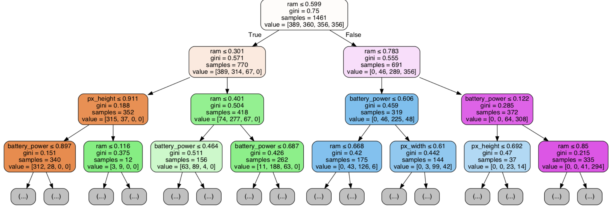

# **Introduction**:

The goal of the following project will be to determine the most important features and most efficient models in classifying the price range (low = 0, mediumn = 1, high = 2, very high = 3) of a phone. Knowing this information can help identify which features a phone company should focus on in designing their phones as well as giving people a model to work with which can help show the fair price of any phone based on features.

My data is composed of 2000 rows across 20 features sourced from kaggle.com with information on phone features such as battery power and pressence of 4G.

## Links:
#### Data https://www.kaggle.com/iabhishekofficial/mobile-price-classification#train.csv
#### GitHub: https://github.com/ArielJosephCohen/Mod_5_P
#### Presentation: https://docs.google.com/presentation/d/1_igi1IM-bah3LhsbrlclEXndclVpjCQVZg2Q0Xxwx-c/edit#slide=id.g35f391192_00

## The first step was to import all the libraries I would need to move forward

## Having loaded all my libraries, I was now ready to load my main data
#### Below is a look at the numerical and categorical features

## Next, I took a quick look at information on the numerical features
#### Below is that decription

## Next, before I assigned X and y, I need to filter misleading outliers
#### Below is that code

## After assigning X and y, I checked for multicolinearity leading to misleading results
#### Below is a heatmap showing no high correlation based on my 70% threshold

## Next, to address differences in magnitude, I applied min-max data scaling to put all numbers between 0 and 1
#### Below is that code

## Next, I applied Box-Cox transformation to normalize my data
#### Below is that code

## Next, I split my data into training and test sets for modeling and validation purposes
#### Below is that code

## Next, I ran some models
#### Below is are the results for the logistic regression model

## I combined the results from all the models into a summary data frame
#### Below is that summary

## Next, I found the most indicative features in phone pricing
#### Below is that data

## For entertainemnt, I have also included a visual I used for my decision tree
#### Below is that visual

### That wraps it up

## Thank you